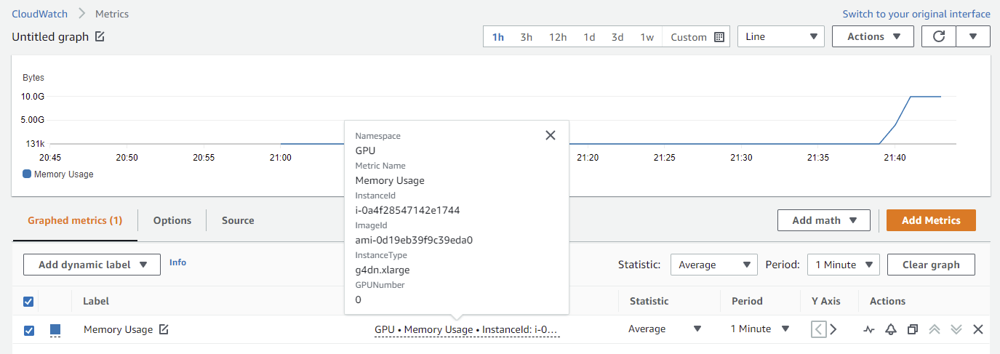

# AWS EKS with shared GPUs

This repo contains the necessary IaC (Infrastructure as Code) files to provision an EKS cluster capable of sharing a single GPU between multiple pods.

## The problem

If you ever tried to use GPU-based instances with AWS ECS, or on EKS using the default [Nvidia plugin](https://github.com/NVIDIA/k8s-device-plugin), you would know that it's not possible to make a task/pod shared the same GPU on an instance. If you want to add more replicas to your service (for redundancy or load balancing), you would need one GPU for each replica.

> *And this doesn't seem to be going to change in the near future for ECS (see this [feature request](https://github.com/aws/containers-roadmap/issues/327#issuecomment-580455803))*

GPU-based instances are expensive, and despite the fact that some Machine Learning frameworks (e.g. Tensorflow) are pre-configured to use the entire GPU by default, that's not always the case. ML services can be configured to make independent inferences by request instead of batch processing, and this would require just a fraction of a 16GiB of VRAM that comes with some instances.

Currently, GPU-based instances only publish to ECS/EKS the amount of GPUs they have. This means that a task/pod can only request a GPU, but not the amount of resources of GPU (like it's possible with CPU and RAM memory). The solution is to make the instance publish the amount of GPU resources (processing cores, memory, etc.) so that a pod can request only a fraction of it.

## Solution

This project uses the k8s device plugin described by [this AWS blog post](https://aws.amazon.com/blogs/opensource/virtual-gpu-device-plugin-for-inference-workload-in-kubernetes/) to make GPU-based nodes publish the amount of GPU resource they have available. Instead of the amount of VRAM available or some abstract metric, this plugin advertises the amount of pods/processes that can be connected to the GPU. This is controlled by what is called by NVIDIA as [Multi-Process Service](https://docs.nvidia.com/deploy/mps/index.html) (MPS).

MPS manages workloads submitted by different processes to allow them to be scheduled and executed concurrently in a GPU. On Volta and newer architectures we can also limit the [amount of threads](https://docs.nvidia.com/deploy/mps/index.html#topic_5_2_5) a process can use from the GPU to limit the shareability of resources and ensure some Quality of Service (QoS) level.

## How to use it

This repo puts it all together to deliver an infrastructure and deployment lifecycle which all can be managed by terraform. Integrally, here is the list of tools needed:

- `terraform`: for infrastructure provisioning and service deployment (including the `DaemonSet` for the device plugin and the `Deployment` for testing);
- `packer`: to create an instrumented AMI for GPU usage monitoring in CloudWatch
- `asdf`: really handy tool used to install other tools in a version-controlled way

The rest will come along in the next steps ;)

At the end, you should have an infrastructure with the following features:

- :heavy_check_mark: EKS cluster with encrypted volumes and secrets using KMS

- :heavy_check_mark: All workers resides on private subnets and access the control plane only from within the VPC (no internet communication)
- :heavy_check_mark: Ip whitelist configured for accessing the k8s api from the internet
- :heavy_check_mark: Instrumented instances with GPU usage monitored in Cloudwatch
- :heavy_check_mark: Nodes can be access with AWS SSM Session Manager (no `ssh` required).

### Installing the tooling

The first tool to be installed is `asdf`. With it, all the other will come after easily. `asdf` can be installed following [this guide](https://asdf-vm.com/guide/getting-started.html) from its documentation page. After that, you should be able to run the following list of commands to install the rest of the tooling.

```
asdf plugin-add terraform https://github.com/asdf-community/asdf-hashicorp.git
asdf plugin-add pre-commit git@github.com:jonathanmorley/asdf-pre-commit.git
asdf plugin-add tflint https://github.com/skyzyx/asdf-tflint
asdf plugin-add https://github.com/MetricMike/asdf-awscli.git

asdf install
pre-commit install
tflint --init
```

This project also comes with `pre-commit` configured to serve as a reference on how terraform-based projects can be configured to check of syntax and linting errors even before a commit is made (so that you don't have to wait for some CI pipeline).

### Creating the AMI

For details about how the AMI is create and what comes with it, I highly suggest you to my [other repo](https://github.com/DanielKneipp/aws-ami-gpu-monitoring) that explains in detail how the AMI works and what IAM permissions it requires.

From [that repo](https://github.com/DanielKneipp/aws-ami-gpu-monitoring), the only thing changed is the base AMI, which in this case an AMI tailored for accelerated hardware on EKS was used. The list of compatible AMIs for EKS can be obtained in [this link](https://docs.aws.amazon.com/eks/latest/userguide/eks-optimized-ami.html) updated regularly by AWS. Also, the AMI from AWS comes with [SSM agent](https://github.com/aws/containers-roadmap/issues/593) in it, so no need to change anything regarding that.

The following commands will create an AMI named `packer-gpu-ami-0-1`, which should be picked automatically by the terraform code of the cluster. *All `terraform` and `packer` commands assume that you already have configured your AWS credentials properly*.

```
cd ami/
packer init gpu.pkr.hcl
packer build .
```

### About the infrastructure

The cluster and network resources are defined together in the `cluster` directory. Here is a small description of them:

- `main.tf`: defines the versions and configuration of the main providers, as well as set values for variables that can be used on other files (e.g. name of the cluster);

- `vpc.tf`: encompass the network configuration where the EKS cluster will be provisioned. It doesn't contain a subnet for the `us-east-1e` because, at the time of this writing, there were no `g4dn.xlarge` available at this availability zone;

- `eks.tf`: contains the cluster definition using managed workers. [Here](https://github.com/DanielKneipp/aws-eks-share-gpu/blob/master/cluster/eks.tf#L54) is also where is defined the `node-label` `k8s.amazonaws.com/accelerator`, important to tell the device-plugin where it should be deployed;

- `kms.tf`: here we have the definition of the Costumer Managed Keys (CMKs) alongside the policies necessary to make them work for the encryption of the volumes of the cluster nodes and k8s secrets;

- `iam.tf`: has the permissions necessary in order to make the Session Manager access work and to allow the nodes to publish metrics on CloudWatch regarding CPU, RAM, swap, disk and GPU usage (go [here](https://docs.aws.amazon.com/systems-manager/latest/userguide/session-manager-getting-started-instance-profile.html) to know more the permissions for Session Manager and [here](https://docs.aws.amazon.com/AmazonCloudWatch/latest/monitoring/create-iam-roles-for-cloudwatch-agent.html) to learn more about permissions required by CloudWatch Agent);

- `aws-virtual-gpu--device-plugin.tf`: Generated from the `yaml`file of the same name obtained from the [AWS blog post](https://aws.amazon.com/blogs/opensource/virtual-gpu-device-plugin-for-inference-workload-in-kubernetes/). Some modifications needed to me made in order to make this `DaemonSet` work. Here they are:

    - The image `nvidia/cuda:latest` doesn't exist anymore as the tag `latest` is now deprecated ([source](https://hub.docker.com/r/nvidia/cuda/)). Because of that, the image `nvidia/cuda:11.4.2-base-ubuntu20.04` is being used instead.

    - The number of `vgpu` configured for the container `aws-virtual-gpu-device-plugin-ctr` was modified from its default of `16` to `42` because NVIDIA architectures after the Volta can handle up to `42` connections to the MPS ([source](https://docs.nvidia.com/deploy/mps/index.html#topic_3_3_5_1)). This has been done to increase how much fractioned the GPU can get. Theoretically (*not tested*) 42 pods could share the same GPU (if they don't surpass the amount of VRAM available). At this point, limitations of instance networking are more restricting than GPU shareability.

    - Because this `vgpu` configuration can have different limits depending on the architecture of the GPU, the plugin also was configured to be deployed on `g4dn.xlarge` instances (see how [here](https://github.com/DanielKneipp/aws-eks-share-gpu/blob/master/cluster/aws-virtual-gpu-device-plugin.tf#L104)) where the architecture is now (Turing) and this demo was tested on.

**Pro tip**: If you want to convert k8s `yaml` files to `.tf`, you can use `k2tf` ([repo](https://github.com/sl1pm4t/k2tf)) that is able to convert the resource types of the `yaml` top their appropriated counterparts of the k8s provider for terraform. To install it, just:

```
wget https://github.com/sl1pm4t/k2tf/releases/download/v0.6.3/k2tf_0.6.3_Linux_x86_64.tar.gz
tar zxvf k2tf_0.6.3_Linux_x86_64.tar.gz k2tf
sudo mv k2tf /usr/local/bin/
rm k2tf_0.6.3_Linux_x86_64.tar.gz
```

After that, you should be able to convert a `yaml` manifest with a simple command like `cat file.yaml | k2tf > file.tf`. This has been done for `cluster/aws-virtual-gpu-device-plugin.yaml` and `app/app.yaml`.

### Provisioning the infrastructure

To provision all of this, the following command should be sufficient:

```
cd cluster/
terraform init
terraform apply
```

The `apply` should show `Plan: 59 to add, 0 to change, 0 to destroy.`. If that's the case, hit `yes` and go grab a cup of of coffee as this can take dozens of minutes.

> After the resources be provisioned, you might want to run `terraform apply -refresh-only` to refresh your local state as the creation of some resource change the state of others within AWS. Also, state differences on `metadata.resource_version` of k8s resources almost always show up after an `apply`. This seems to be related to [this issue](https://github.com/hashicorp/terraform-provider-kubernetes/issues/1087).

Now you should see an EKS cluster with the following workloads:


### About the app

The app is a `Deployment` also obtained from the [AWS blog post](ttps://aws.amazon.com/blogs/opensource/virtual-gpu-device-plugin-for-inference-workload-in-kubernetes/) that spawns 3 replicas of a resnet model in the cluster. [This line](https://github.com/DanielKneipp/aws-eks-share-gpu/blob/master/app/app.tf#L65) defines "how much" GPU it needs. Because of this requirement, k8s will not schedule a pod of this deployment to a node that doesn't have a GPU.

This deployment is configured to use 20% of the GPU memory (using a tensorflow feature [here](https://github.com/DanielKneipp/aws-eks-share-gpu/blob/master/app/app.tf#L50)). Based on this VRAM usage, we need to configure how many of the 48 process slots from MPS of an instance we wan't to reserve. Let's use `ceil` to be conservative, so `ceil(48 * 0.2) = 10`. With this we should be able to schedule even 4 replicas in the same instance.

### Deploying the app

Since we're using the same tool for infrastructure management and app deployment, now we leverage this by following the exact same procedure to deploy the app.

```
cd app/
terraform init
terraform apply
```

And now you should be seeing the resnet workload deployed like this:


Also, we can see the on CloudWatch the amount of VRAM used in that instance to confirm that more than one replica
is actually allocating resources there. To know more about the new metrics available in ClodWatch published by instances using this custom AMI, please go [here](https://github.com/DanielKneipp/aws-ami-gpu-monitoring)



Now, what about we scale the deployment to `4` replicas? Please, go to [this line](https://github.com/DanielKneipp/aws-eks-share-gpu/blob/master/app/app.tf#L19) and change the amount of replicas from `3` to `4` and run another `tf apply`. After some time (~3-5 minutes) you should be able to see the VRAM usage of that instance increasing a bit more, like this:


### Clean-up

Leveraging again the fact we interact mostly with terraform, clean everything should be as simple as:

```
cd app/
tf destroy

cd ../cluster/
tf destroy
```

**Note**: The order matters because you can't delete the EKS cluster before removing the resources allocated in it, otherwise you should get error messages from AWS API about *resource* still being used.

Also, don't forget follow the clean-up procedure of the [AMI repo](https://github.com/DanielKneipp/aws-ami-gpu-monitoring) to delete the created AMI and avoid EBS costs.

## Todo next

- [ ] Implement/test autoscaling features making a load test to resnet
- [ ] Enable and use [IRSA](https://aws.amazon.com/blogs/opensource/introducing-fine-grained-iam-roles-service-accounts/)
- [ ] Add [Infracost](https://www.infracost.io/) on pre-commit config

## Wrap-up

Here we've implemented a complete infrastructure for an EKS cluster with shared GPU-based instances.

Please, fell free to reach out to me on my [github](https://github.com/DanielKneipp) or [linkedin](https://www.linkedin.com/in/daniel-kneipp/) accounts for suggestions or questions. :v:
